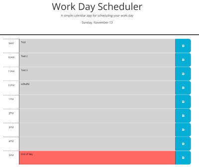

# current-work-day-scheduler-wk

## Description

This is a work day planner for the current day! I created this project to showcase the various Javasciript skills I've learned during camp thus far.

The most challenging part of this project was the use of DOM manipulation. I probably spent about 90% of my time trying to duplicate the body of HTML using Javascript. Also, my lack of ability to recognize differences between methods, selectors, values made this challenge much more difficult than it could have been.

Once I was finally able to duplicate the HTML in my JS, the rest of the project wasn't too bad. I was able to add the event listener fairly easy. Figuring out how to get the tasks to store to local storage correctly was challenging but I am very happy with my solution. 

I would've liked to showcase dayJS() a little more. But I found it difficult to use when comparing to hour rows and was unable to figure out the proper syntax to make it work. I ended up using vanilla JS to create all the time elements but I used JQuery to append elements and setAttributes.

Although I spent more time planning ahead for this project, it did not prepare me for the amount of syntax issues I came accross. I spent hours re-writing and re-organinizing single parts of my code only to find the simplest solutions. I tend want to look at the bigger picture, but I learned from this project that taking it one small piece of code at a time would likely save me hours of testing and re-writing in the future.

This project was tough but I enjoyed it very much.
Enjoy!

## Installation

 * To deploy application, go to [My Github Project](https://wiilki.github.io/current-work-day-scheduler-wk/)

## Usage

 * Enter your scheduled task in corresponding hour box
 * Click save button on right
 * Tasks should store to local storage
 * Tasks should render back to corresponding hour box
 * Color of box should change depending on current hour

## Credits

* [Jquery](https://code.jquery.com/jquery-3.5.1.min.js)